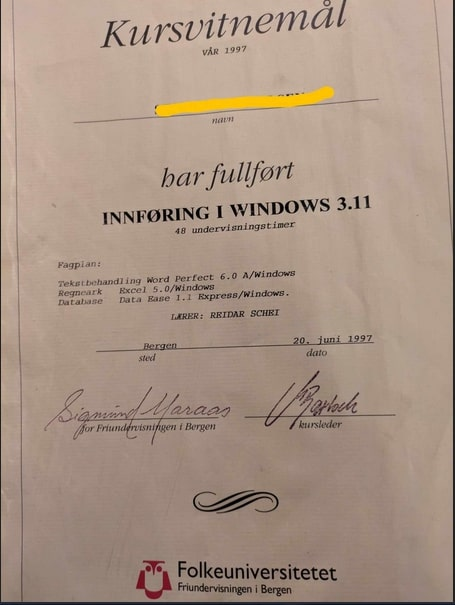

## 

- 🔭 I make funny JS & CSS code with demo- link or test-button(s)
- 🌱 I also do;server-stuff,and pentesting.
      
- 👯  TODO
  
- 🤠 Fun fact:
     My first data course in 1997;
     Windows 3.11, Database 1.1, Excel 5.

 

(<a href="#up">Up To Page Top</a>)

